# Ninja Monkey Function Blocks 🐒🍭

Welcome to the **Ninja Monkey Function Blocks** repository! This is the companion source code for the fun and insightful [Ninja Monkey](https://www.youtube.com/@ninjamonkeystutorials) video series on **OOP in PLC programming** using [TwinCAT 3 4026](https://www.beckhoff.com/en-en/products/automation/twincat/twincat-3-build-4026/). 🎥

[🎥 watch part 1](https://www.youtube.com/watch?v=z1h-uQhCY4A)

## Table-Of-Contents

## 🍭 Table of Contents

* [🍬 What’s Inside?](#what-is-inside)  
* [💖 Why You’ll Love It ❤️](#why-you-will-love-it)  
* [🎨 Sweet Diagrams](#diagrams)  
    - [🗺️ Overview](#overview)  
    - [🧩 Types](#types)  
        - [📜 Enumerations](#enumerations)  
        - [🔀 Alias Types](#alias)  
    - [🔧 AnyToArg](#anytoarg)  
    - [📝 Logger System](#logger)  
        - [🏗️ Abstract Logger](#abstract-logger)  
        - [🛠️ ADS Logger](#ads-logger)  
        - [📦 Logger Provider](#logger-provider)  
    - [🍫 Candy Preferences](#candy-preferences)  
        - [🎯 Individual Candy Preferences](#individualcandypreferences)  
        - [🌀 Ajnin’s Candy Preferences](#ajninscandypreferences)  
    - [🧍‍♂️ Candy Consumers](#candy-consumer)  
        - [🎭 Abstract Candy Consumer](#abstract-candy-consumer)  
        - [🐒 NinjaMonkey](#ninjamonkey)  
    - [🚚 Candy Dispatcher](#candy-dispatcher)  
        - [🎛️ Abstract Candy Dispatcher](#abstract-candy-dispatcher)  
        - [🏗️ Concrete Candy Dispatchers](#concrete-candy-dispatchers)  
        - [🏭 Candy Dispatcher Factory](#candy-dispatcher-factory)  
    - [🍬 Candies](#candies)  
        - [🌟 Abstract Candy](#abstract-candy)  
        - [🍫 Concrete Candies](#concrete-candies)  
    - [🤖 Candy Machines](#candy-machine)  
        - [🛠️ Abstract Candy Machine](#abstract-candy-machine)  
        - [🌈 Common Candy Machine](#common-candy-machine)  
        - [😋 Greedy Candy Machine](#greedy-candy-machine)  
        - [🚫 Picky Candy Machine](#picky-candy-machine)  
    - [🥋 Ninja Candy Consume Behavior](#abstractninjacandyconsumebehavior)  
        - [🤔 Abstract Ninja Candy Behavior](#abstractninjacandyconsumebehavior)  
        - [🌟 Common Ninja Candy Behavior](#commonninjacandybehavior)  
        - [🍴 Greedy Ninja Candy Behavior](#greedyninjacandybehavior)  
        - [🛑 Picky Ninja Candy Behavior](#pickyninjacandybehavior)  

* [📜 Version Log](#version-log)
    - [🎉 Versions](#Versions)

## What is inside

In this video, you’ll learn how to build a **candy vending machine** 🍭 with **candies** 🍬 and **consumers** 🧍‍♀️🧍‍♂️. Along the way, the code and video will guide you through key concepts of **Object-Oriented Programming (OOP)** in PLCs:

- 🏛️ **Classes, Methods, and Properties**
- 🔒 **Access Specifiers** (who can access what!)
- 🔄 **Inheritance** (like family traits for code)
- 🌐 **Abstraction** (simplifying complexity)
- 🛠️ **Dynamic Object Creation** (objects on the fly!)
- 🤝 **Techniques** like **delegation** and **dependency injection**.

> ⚠️ **Note:** This video does **not** cover `Interface`s—that’s reserved for another tutorial. Stay tuned!

## Why You Will Love It

Whether you're just starting out with PLC programming or looking to expand your OOP skills, this project is designed to teach and inspire. With clear explanations and practical examples, you’ll be able to take your PLC programming to the next level.
So grab some candy 🍬, dive in, and let’s build something sweet!

## Diagrams

### overview

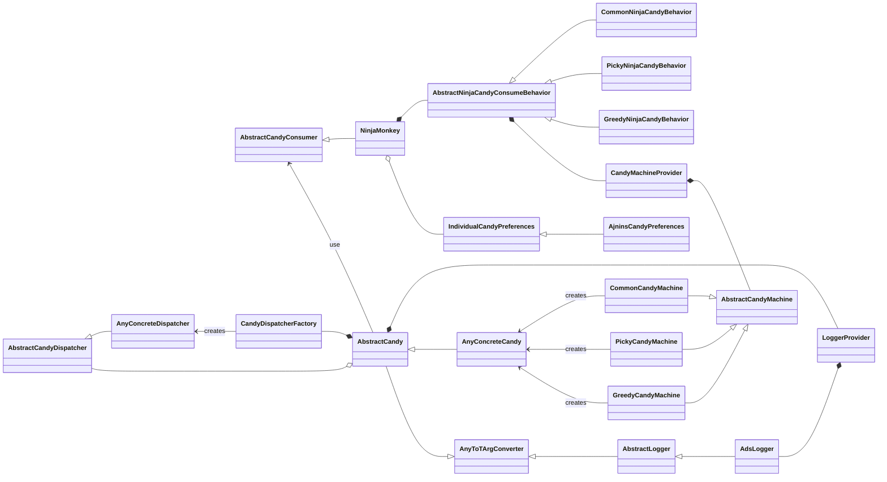
```mermaid
classDiagram
    direction LR

    AbstractCandy --|> AnyToTArgConverter 
    LoggerProvider --* AbstractCandy 
    AbstractCandyConsumer <-- AbstractCandy :use
    CandyDispatcherFactory --* AbstractCandy 
    AbstractCandyDispatcher --o AbstractCandy 

    AbstractCandyDispatcher <|-- AnyConcreteDispatcher 
    AnyConcreteDispatcher <-- CandyDispatcherFactory :creates

    AnyToTArgConverter <|-- AbstractLogger
    AbstractLogger <|-- AdsLogger 
    AdsLogger --* LoggerProvider 

    IndividualCandyPreferences <|-- AjninsCandyPreferences 
    AbstractCandyConsumer <|-- NinjaMonkey 
    NinjaMonkey o-- IndividualCandyPreferences 
    NinjaMonkey *-- AbstractNinjaCandyConsumeBehavior 

    AbstractCandy <|-- AnyConcreteCandy 
    
    GreedyCandyMachine --|> AbstractCandyMachine 
    AnyConcreteCandy <-- GreedyCandyMachine :creates
    
    PickyCandyMachine --|> AbstractCandyMachine 
    AnyConcreteCandy <-- PickyCandyMachine :creates

    CommonCandyMachine --|> AbstractCandyMachine 
    AnyConcreteCandy <-- CommonCandyMachine :creates
    CandyMachineProvider *-- AbstractCandyMachine
 
    AbstractNinjaCandyConsumeBehavior *-- CandyMachineProvider 
    AbstractNinjaCandyConsumeBehavior <|-- GreedyNinjaCandyBehavior 
    AbstractNinjaCandyConsumeBehavior <|-- PickyNinjaCandyBehavior 
    AbstractNinjaCandyConsumeBehavior <|-- CommonNinjaCandyBehavior 
```

### types

#### enumerations

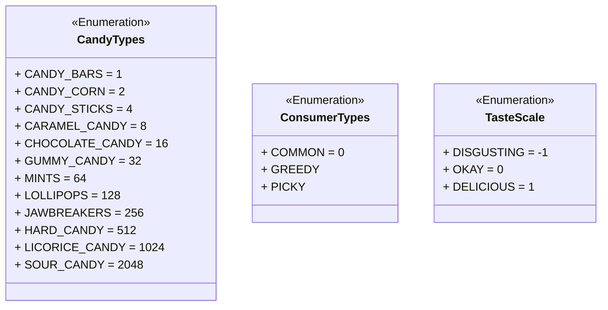
```mermaid
classDiagram
    class CandyTypes{
        <<Enumeration>>
        + CANDY_BARS = 1
        + CANDY_CORN = 2
        + CANDY_STICKS = 4
        + CARAMEL_CANDY = 8
        + CHOCOLATE_CANDY = 16
        + GUMMY_CANDY = 32
        + MINTS = 64
        + LOLLIPOPS = 128
        + JAWBREAKERS = 256
        + HARD_CANDY = 512
        + LICORICE_CANDY = 1024
        + SOUR_CANDY = 2048
    }
    class ConsumerTypes{
        <<Enumeration>>
        + COMMON = 0
        + GREEDY
        + PICKY
    }
    class TasteScale{
        <<Enumeration>>
        + DISGUSTING = -1
        + OKAY = 0
        + DELICIOUS = 1
    }
```

#### alias

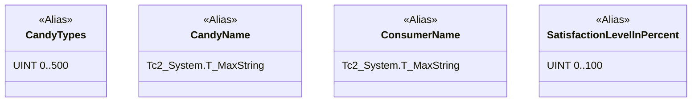
```mermaid
classDiagram
    class CandyTypes{
        <<Alias>>
        UINT 0..500
    }
    class CandyName{
        <<Alias>>
        Tc2_System.T_MaxString
    }
    class ConsumerName{
        <<Alias>>
        Tc2_System.T_MaxString
    }
    class SatisfactionLevelInPercent{
        <<Alias>>
        UINT 0..100
    }
```

### AnyToArg

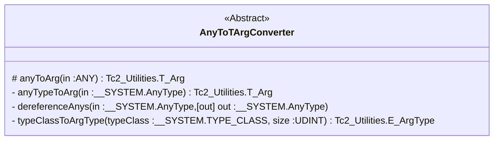
```mermaid
classDiagram
    class AnyToTArgConverter{
        <<Abstract>>
        # anyToArg(in :ANY) Tc2_Utilities.T_Arg
        - anyTypeToArg(in :__SYSTEM.AnyType) Tc2_Utilities.T_Arg
        - dereferenceAnys(in :__SYSTEM.AnyType,[out] out :__SYSTEM.AnyType)
        - typeClassToArgType(typeClass :__SYSTEM.TYPE_CLASS, size :UDINT) Tc2_Utilities.E_ArgType
    }
```

### logger

#### abstract logger

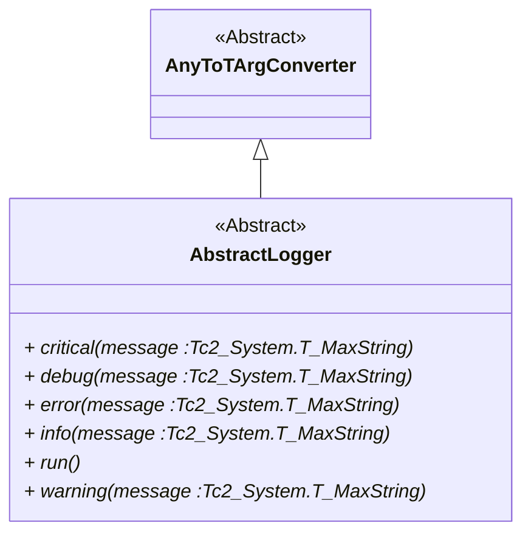
```mermaid
classDiagram
    AnyToTArgConverter <|-- AbstractLogger
    class AbstractLogger{
        <<Abstract>>
        + critical(message :Tc2_System.T_MaxString)*
        + debug(message :Tc2_System.T_MaxString)*
        + error(message :Tc2_System.T_MaxString)*
        + info(message :Tc2_System.T_MaxString)*
        + run()*
        + warning(message :Tc2_System.T_MaxString)*
    }
    class AnyToTArgConverter{
        <<Abstract>>
    }
```

#### ads logger

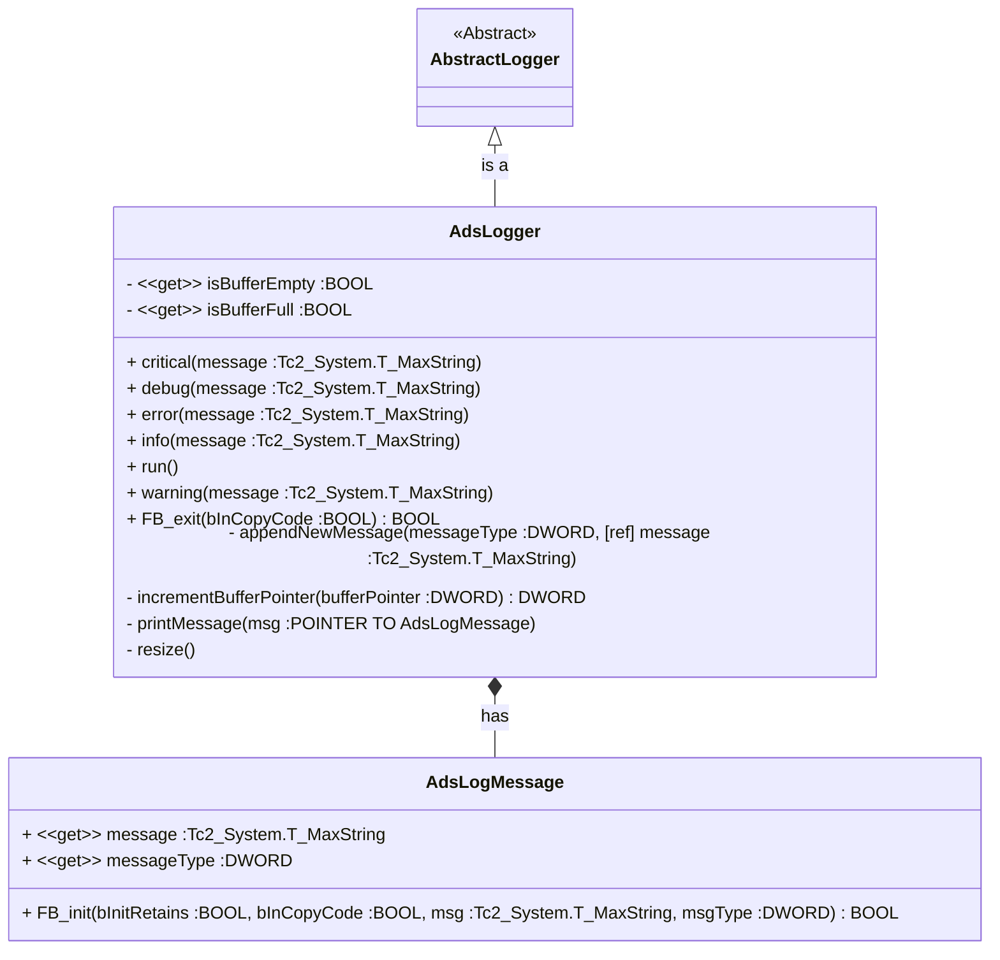
```mermaid
classDiagram
    AbstractLogger <|-- AdsLogger :is a
    AdsLogger *-- AdsLogMessage :has
    class AdsLogger{
        - ~~get~~ isBufferEmpty :BOOL
        - ~~get~~ isBufferFull :BOOL
        + critical(message :Tc2_System.T_MaxString)
        + debug(message :Tc2_System.T_MaxString)
        + error(message :Tc2_System.T_MaxString)
        + info(message :Tc2_System.T_MaxString)
        + run()
        + warning(message :Tc2_System.T_MaxString)
        + FB_exit(bInCopyCode :BOOL) BOOL
        - appendNewMessage(messageType :DWORD, [ref] message :Tc2_System.T_MaxString)
        - incrementBufferPointer(bufferPointer :DWORD) DWORD
        - printMessage(msg :POINTER TO AdsLogMessage)
        - resize()
    }
    class AdsLogMessage{
        + ~~get~~ message :Tc2_System.T_MaxString
        + ~~get~~ messageType :DWORD
        + FB_init(bInitRetains :BOOL, bInCopyCode :BOOL, msg :Tc2_System.T_MaxString, msgType :DWORD) BOOL
    }
    class AbstractLogger{
        <<Abstract>>
    }
```

#### logger provider

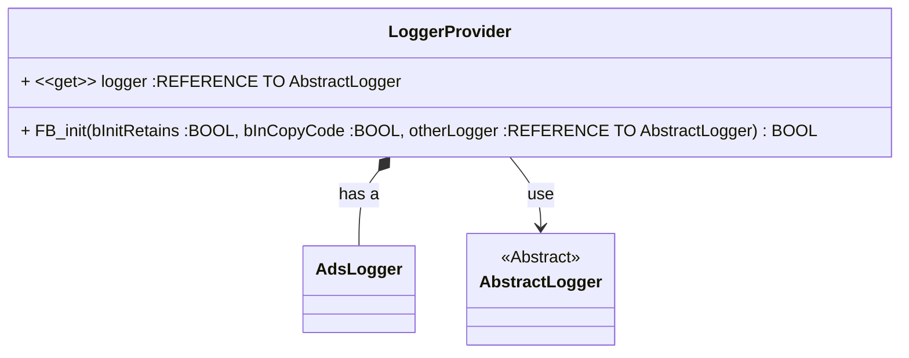
```mermaid
classDiagram
    LoggerProvider *-- AdsLogger :has a
    LoggerProvider --> AbstractLogger :use
    class LoggerProvider{
        + ~~get~~ logger :REFERENCE TO AbstractLogger
        + FB_init(bInitRetains :BOOL, bInCopyCode :BOOL, otherLogger :REFERENCE TO AbstractLogger) BOOL
    }
    class AdsLogger
    class AbstractLogger{
        <<Abstract>>
    }    
```

### candy preferences

#### IndividualCandyPreferences

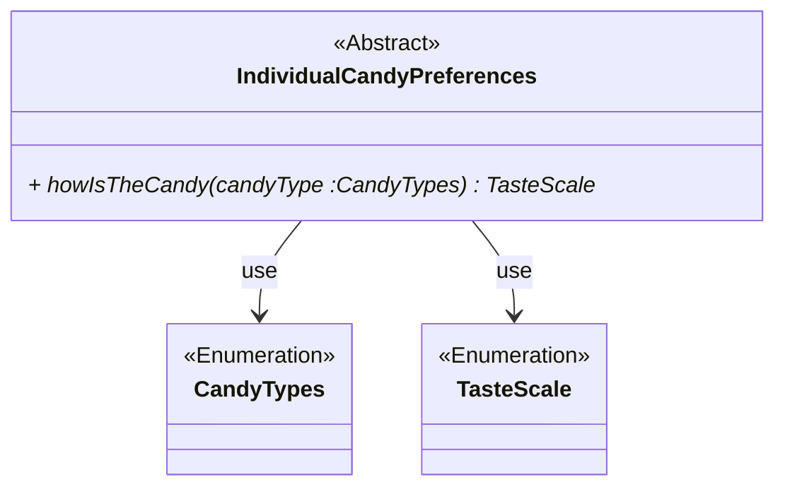
```mermaid
classDiagram
    IndividualCandyPreferences --> CandyTypes :use
    IndividualCandyPreferences --> TasteScale :use
    class IndividualCandyPreferences{
        <<Abstract>>
        + howIsTheCandy(candyType :CandyTypes) TasteScale*
    }
    class CandyTypes{
        <<Enumeration>>
    }
    class TasteScale{
        <<Enumeration>>
    }
```

#### AjninsCandyPreferences

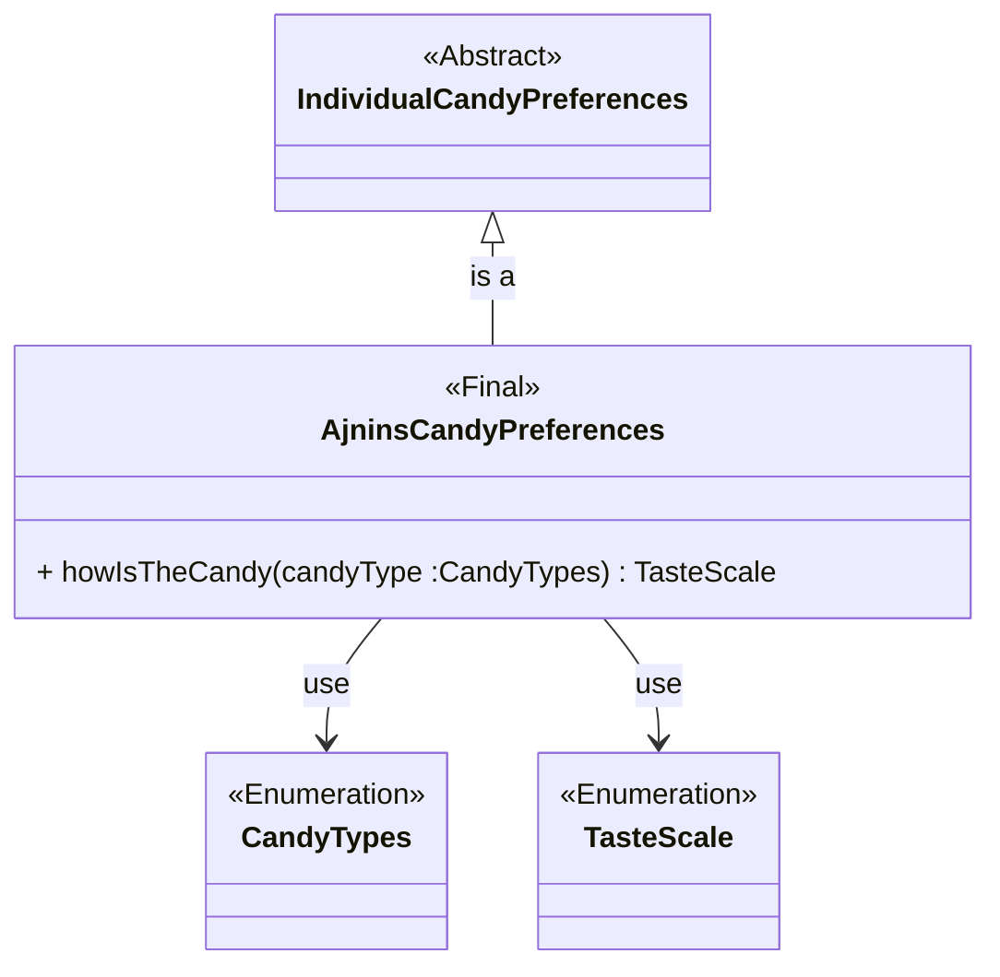
```mermaid
classDiagram
    IndividualCandyPreferences <|-- AjninsCandyPreferences :is a
    AjninsCandyPreferences --> CandyTypes :use
    AjninsCandyPreferences --> TasteScale :use
    class AjninsCandyPreferences{
        <<Final>>
        + howIsTheCandy(candyType :CandyTypes) TasteScale
    }
    class IndividualCandyPreferences{
        <<Abstract>>
    }
    class CandyTypes{
        <<Enumeration>>
    }
    class TasteScale{
        <<Enumeration>>
    }
```

### candy consumer

#### abstract candy consumer

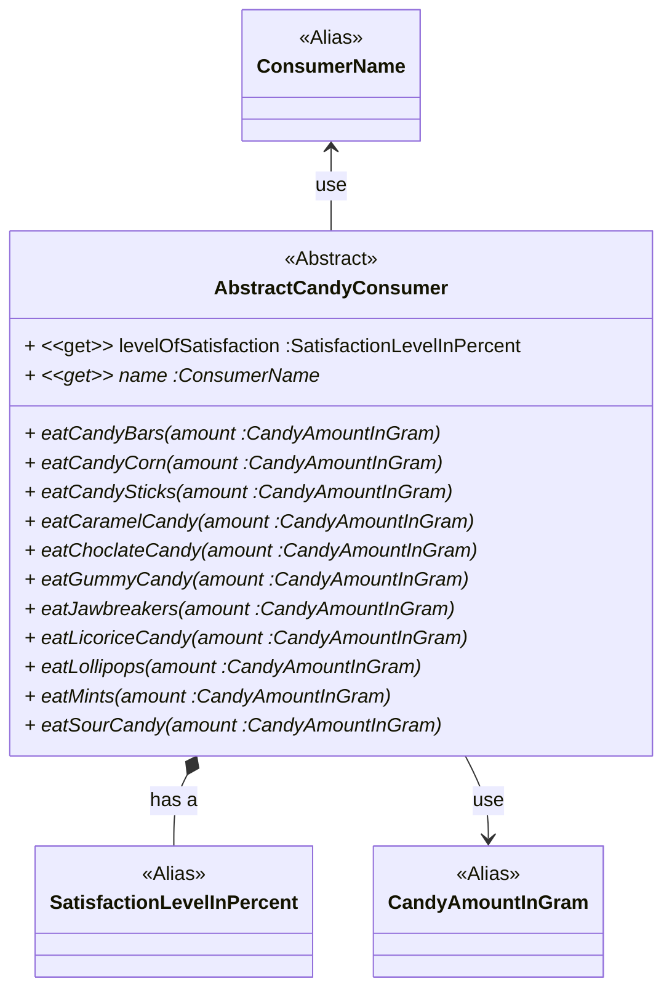
```mermaid
classDiagram
    AbstractCandyConsumer *-- SatisfactionLevelInPercent :has a
    ConsumerName <-- AbstractCandyConsumer :use
    AbstractCandyConsumer --> CandyAmountInGram :use
    class AbstractCandyConsumer{
        <<Abstract>>
        + ~~get~~ levelOfSatisfaction :SatisfactionLevelInPercent
        + ~~get~~ name :ConsumerName*
        + eatCandyBars(amount :CandyAmountInGram)*
        + eatCandyCorn(amount :CandyAmountInGram)*
        + eatCandySticks(amount :CandyAmountInGram)*
        + eatCaramelCandy(amount :CandyAmountInGram)*
        + eatChoclateCandy(amount :CandyAmountInGram)*
        + eatGummyCandy(amount :CandyAmountInGram)*
        + eatJawbreakers(amount :CandyAmountInGram)*
        + eatLicoriceCandy(amount :CandyAmountInGram)*
        + eatLollipops(amount :CandyAmountInGram)*
        + eatMints(amount :CandyAmountInGram)*
        + eatSourCandy(amount :CandyAmountInGram)*
    }
    class CandyAmountInGram{
        <<Alias>>
    }
    class ConsumerName{
        <<Alias>>
    }
    class SatisfactionLevelInPercent{
        <<Alias>>
    }
```

#### NinjaMonkey

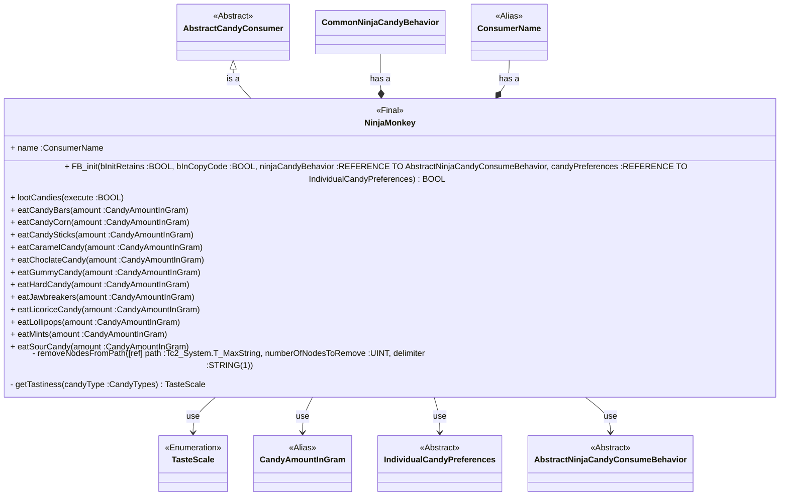
```mermaid
classDiagram
    AbstractCandyConsumer <|-- NinjaMonkey :is a
    CommonNinjaCandyBehavior --* NinjaMonkey :has a
    ConsumerName --* NinjaMonkey :has a
    NinjaMonkey --> TasteScale :use
    NinjaMonkey --> CandyAmountInGram :use
    NinjaMonkey --> IndividualCandyPreferences :use
    NinjaMonkey --> AbstractNinjaCandyConsumeBehavior :use

    class NinjaMonkey{
        <<Final>>
        + name :ConsumerName
        + FB_init(bInitRetains :BOOL, bInCopyCode :BOOL, ninjaCandyBehavior :REFERENCE TO AbstractNinjaCandyConsumeBehavior, candyPreferences :REFERENCE TO IndividualCandyPreferences) BOOL
        + lootCandies(execute :BOOL)
        + eatCandyBars(amount :CandyAmountInGram)
        + eatCandyCorn(amount :CandyAmountInGram)
        + eatCandySticks(amount :CandyAmountInGram)
        + eatCaramelCandy(amount :CandyAmountInGram)
        + eatChoclateCandy(amount :CandyAmountInGram)
        + eatGummyCandy(amount :CandyAmountInGram)
        + eatHardCandy(amount :CandyAmountInGram)
        + eatJawbreakers(amount :CandyAmountInGram)
        + eatLicoriceCandy(amount :CandyAmountInGram)
        + eatLollipops(amount :CandyAmountInGram)
        + eatMints(amount :CandyAmountInGram)
        + eatSourCandy(amount :CandyAmountInGram)
        - removeNodesFromPath([ref] path :Tc2_System.T_MaxString, numberOfNodesToRemove :UINT, delimiter :STRING(1))
        - getTastiness(candyType :CandyTypes) TasteScale
    }
    class AbstractCandyConsumer{
        <<Abstract>>
    }
    class AbstractNinjaCandyConsumeBehavior{
        <<Abstract>>
    }
    class IndividualCandyPreferences{
        <<Abstract>>
    }
    class CommonNinjaCandyBehavior
    class ConsumerName{
        <<Alias>>
    }
    class TasteScale{
        <<Enumeration>>
    }
    class CandyAmountInGram{
        <<Alias>>
    }
```

### candy dispatcher

#### abstract candy dispatcher

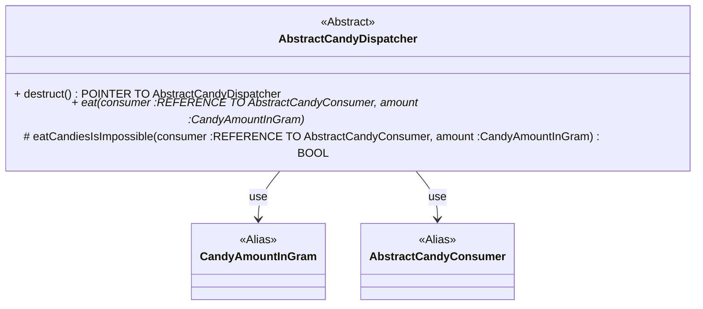
```mermaid
classDiagram
    AbstractCandyDispatcher --> CandyAmountInGram :use
    AbstractCandyDispatcher --> AbstractCandyConsumer :use
    class AbstractCandyDispatcher{
        <<Abstract>>
        + destruct() POINTER TO AbstractCandyDispatcher
        + eat(consumer :REFERENCE TO AbstractCandyConsumer, amount :CandyAmountInGram)*
        # eatCandiesIsImpossible(consumer :REFERENCE TO AbstractCandyConsumer, amount :CandyAmountInGram) BOOL
    }
    class CandyAmountInGram{
        <<Alias>>
    }
    class AbstractCandyConsumer{
        <<Alias>>
    }
```

#### concrete candy dispatchers

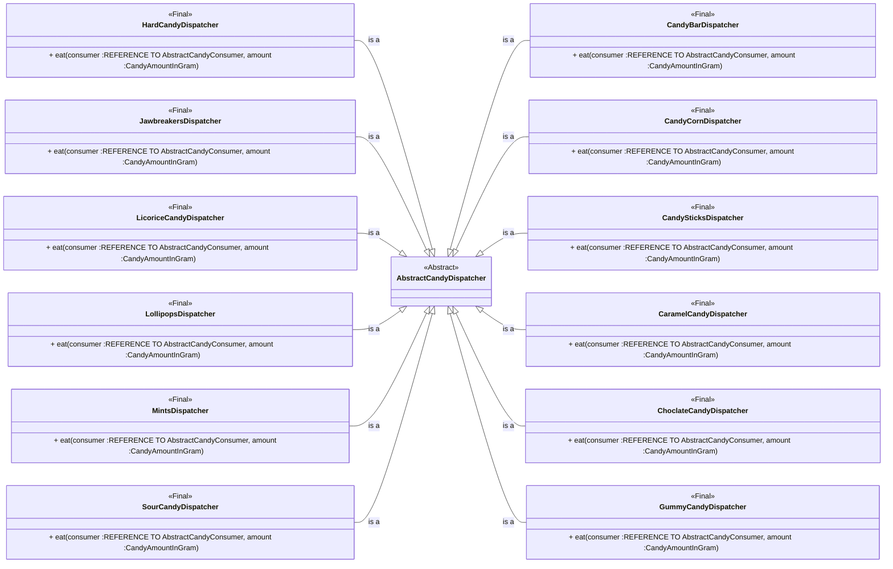
```mermaid
classDiagram
    direction LR
    AbstractCandyDispatcher <|-- CandyBarDispatcher :is a
    AbstractCandyDispatcher <|-- CandyCornDispatcher :is a
    AbstractCandyDispatcher <|-- CandySticksDispatcher :is a
    AbstractCandyDispatcher <|-- CaramelCandyDispatcher :is a
    AbstractCandyDispatcher <|-- ChoclateCandyDispatcher :is a
    AbstractCandyDispatcher <|-- GummyCandyDispatcher :is a
    HardCandyDispatcher --|> AbstractCandyDispatcher :is a
    JawbreakersDispatcher --|> AbstractCandyDispatcher :is a
    LicoriceCandyDispatcher --|> AbstractCandyDispatcher :is a
    LollipopsDispatcher --|> AbstractCandyDispatcher :is a
    MintsDispatcher --|> AbstractCandyDispatcher :is a
    SourCandyDispatcher --|> AbstractCandyDispatcher :is a

    class AbstractCandyDispatcher{
        <<Abstract>>
    }
    class CandyBarDispatcher{
        <<Final>>
        + eat(consumer :REFERENCE TO AbstractCandyConsumer, amount :CandyAmountInGram)
    }
    class CandyCornDispatcher{
        <<Final>>
        + eat(consumer :REFERENCE TO AbstractCandyConsumer, amount :CandyAmountInGram)
    }
    class CandySticksDispatcher{
        <<Final>>
        + eat(consumer :REFERENCE TO AbstractCandyConsumer, amount :CandyAmountInGram)
    }
    class CaramelCandyDispatcher{
        <<Final>>
        + eat(consumer :REFERENCE TO AbstractCandyConsumer, amount :CandyAmountInGram)
    }
    class ChoclateCandyDispatcher{
        <<Final>>
        + eat(consumer :REFERENCE TO AbstractCandyConsumer, amount :CandyAmountInGram)
    }
    class GummyCandyDispatcher{
        <<Final>>
        + eat(consumer :REFERENCE TO AbstractCandyConsumer, amount :CandyAmountInGram)
    }
    class HardCandyDispatcher{
        <<Final>>
        + eat(consumer :REFERENCE TO AbstractCandyConsumer, amount :CandyAmountInGram)
    }
    class JawbreakersDispatcher{
        <<Final>>
        + eat(consumer :REFERENCE TO AbstractCandyConsumer, amount :CandyAmountInGram)
    }
    class LicoriceCandyDispatcher{
        <<Final>>
        + eat(consumer :REFERENCE TO AbstractCandyConsumer, amount :CandyAmountInGram)
    }
    class LollipopsDispatcher{
        <<Final>>
        + eat(consumer :REFERENCE TO AbstractCandyConsumer, amount :CandyAmountInGram)
    }
    class MintsDispatcher{
        <<Final>>
        + eat(consumer :REFERENCE TO AbstractCandyConsumer, amount :CandyAmountInGram)
    }
    class SourCandyDispatcher{
        <<Final>>
        + eat(consumer :REFERENCE TO AbstractCandyConsumer, amount :CandyAmountInGram)
    }
```

#### candy dispatcher factory

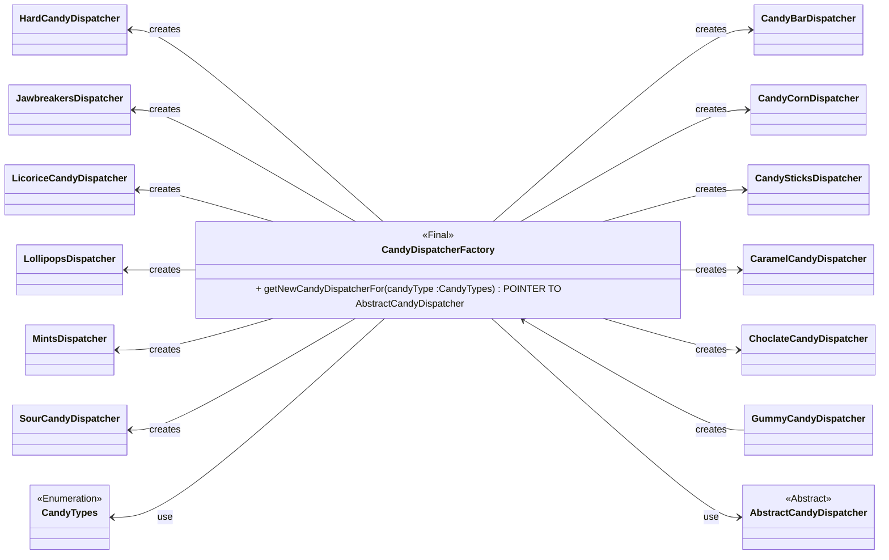
```mermaid
classDiagram
    direction LR
    CandyDispatcherFactory --> CandyBarDispatcher :creates
    CandyDispatcherFactory --> CandyCornDispatcher :creates
    CandyDispatcherFactory --> CandySticksDispatcher :creates
    CandyDispatcherFactory --> CaramelCandyDispatcher :creates
    CandyDispatcherFactory --> ChoclateCandyDispatcher :creates
    CandyDispatcherFactory <-- GummyCandyDispatcher :creates
    CandyDispatcherFactory --> AbstractCandyDispatcher :use
    HardCandyDispatcher <-- CandyDispatcherFactory :creates
    JawbreakersDispatcher <-- CandyDispatcherFactory :creates
    LicoriceCandyDispatcher <-- CandyDispatcherFactory :creates
    LollipopsDispatcher <-- CandyDispatcherFactory :creates
    MintsDispatcher <-- CandyDispatcherFactory :creates
    SourCandyDispatcher <-- CandyDispatcherFactory :creates
    CandyTypes <-- CandyDispatcherFactory :use
    class CandyDispatcherFactory{
        <<Final>>
        + getNewCandyDispatcherFor(candyType :CandyTypes) POINTER TO AbstractCandyDispatcher
    }
    class AbstractCandyDispatcher{
        <<Abstract>>
    }
    class CandyTypes{
        <<Enumeration>>
    }
    class CandyBarDispatcher
    class CandyCornDispatcher
    class CandySticksDispatcher
    class CaramelCandyDispatcher
    class ChoclateCandyDispatcher
    class GummyCandyDispatcher
    class HardCandyDispatcher
    class JawbreakersDispatcher
    class LicoriceCandyDispatcher
    class LollipopsDispatcher
    class MintsDispatcher
    class SourCandyDispatcher
```

### candies

#### abstract candy

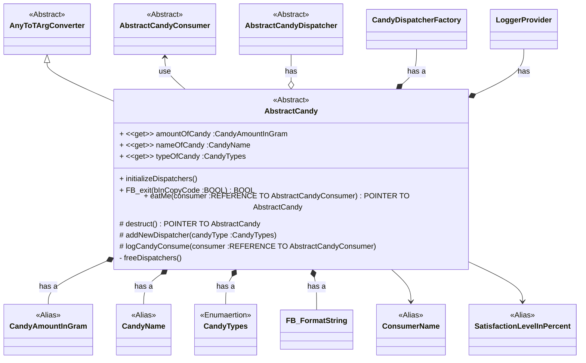
```mermaid
classDiagram
    AbstractCandy *-- CandyAmountInGram :has a
    AbstractCandy *-- CandyName :has a
    AbstractCandy *-- CandyTypes :has a
    AbstractCandy *-- FB_FormatString :has a
    AbstractCandy --> ConsumerName
    AbstractCandy --> SatisfactionLevelInPercent 
    AnyToTArgConverter <|-- AbstractCandy
    AbstractCandyConsumer <-- AbstractCandy :use
    AbstractCandyDispatcher --o AbstractCandy :has
    CandyDispatcherFactory --* AbstractCandy :has a
    LoggerProvider --* AbstractCandy :has
    class AbstractCandy{
        <<Abstract>>
        + ~~get~~ amountOfCandy :CandyAmountInGram
        + ~~get~~ nameOfCandy :CandyName
        + ~~get~~ typeOfCandy :CandyTypes
        + initializeDispatchers()
        + FB_exit(bInCopyCode :BOOL) BOOL
        + eatMe(consumer :REFERENCE TO AbstractCandyConsumer) POINTER TO AbstractCandy
        # destruct() POINTER TO AbstractCandy
        # addNewDispatcher(candyType :CandyTypes) 
        # logCandyConsume(consumer :REFERENCE TO AbstractCandyConsumer) 
        - freeDispatchers()
    }
    class AbstractCandyConsumer{
        <<Abstract>>
    }
    class CandyAmountInGram{
        <<Alias>>
    }
    class CandyName{
        <<Alias>>
    }
    class CandyTypes{
        <<Enumaertion>>
    }
    class AbstractCandyDispatcher{
        <<Abstract>>
    }
    class CandyDispatcherFactory
    class LoggerProvider
    class FB_FormatString
    class AnyToTArgConverter{
        <<Abstract>>
    }
    class ConsumerName{
        <<Alias>>
    }
    class SatisfactionLevelInPercent{
        <<Alias>>
    }
```

#### concrete candies

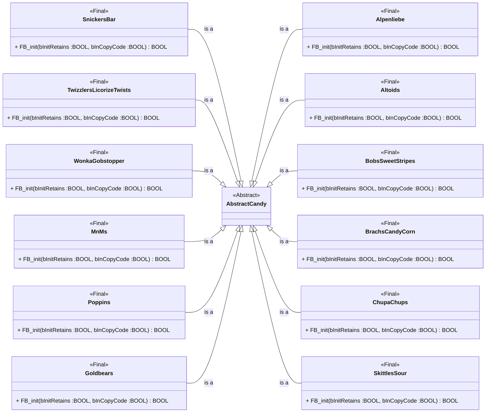
```mermaid
classDiagram
    direction LR
    AbstractCandy <|-- Alpenliebe :is a
    AbstractCandy <|-- Altoids :is a
    AbstractCandy <|-- BobsSweetStripes :is a
    AbstractCandy <|-- BrachsCandyCorn :is a
    AbstractCandy <|-- ChupaChups :is a
    AbstractCandy <|-- SkittlesSour :is a
    SnickersBar --|> AbstractCandy :is a
    TwizzlersLicorizeTwists --|> AbstractCandy :is a
    WonkaGobstopper --|> AbstractCandy :is a
    MnMs --|> AbstractCandy :is a
    Poppins --|> AbstractCandy :is a
    Goldbears --|> AbstractCandy :is a

    class AbstractCandy{
        <<Abstract>>
    }
    class Alpenliebe{
        <<Final>>
        + FB_init(bInitRetains :BOOL, bInCopyCode :BOOL) BOOL
    }
    class Altoids{
        <<Final>>
        + FB_init(bInitRetains :BOOL, bInCopyCode :BOOL) BOOL
    }
    class BobsSweetStripes{
        <<Final>>
        + FB_init(bInitRetains :BOOL, bInCopyCode :BOOL) BOOL
    }
    class BrachsCandyCorn{
        <<Final>>
        + FB_init(bInitRetains :BOOL, bInCopyCode :BOOL) BOOL
    }
    class ChupaChups{
        <<Final>>
        + FB_init(bInitRetains :BOOL, bInCopyCode :BOOL) BOOL
    }
    class SkittlesSour{
        <<Final>>
        + FB_init(bInitRetains :BOOL, bInCopyCode :BOOL) BOOL
    }
    class SnickersBar{
        <<Final>>
        + FB_init(bInitRetains :BOOL, bInCopyCode :BOOL) BOOL
    }
    class TwizzlersLicorizeTwists{
        <<Final>>
        + FB_init(bInitRetains :BOOL, bInCopyCode :BOOL) BOOL
    }
    class WonkaGobstopper{
        <<Final>>
        + FB_init(bInitRetains :BOOL, bInCopyCode :BOOL) BOOL
    }
    class MnMs{
        <<Final>>
        + FB_init(bInitRetains :BOOL, bInCopyCode :BOOL) BOOL
    }
    class Poppins{
        <<Final>>
        + FB_init(bInitRetains :BOOL, bInCopyCode :BOOL) BOOL
    }
    class Goldbears{
        <<Final>>
        + FB_init(bInitRetains :BOOL, bInCopyCode :BOOL) BOOL
    }
```

### candy machine

#### abstract candy machine

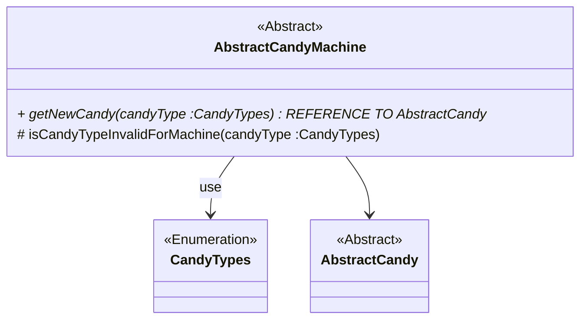
```mermaid
classDiagram
    AbstractCandyMachine --> CandyTypes :use
    AbstractCandyMachine --> AbstractCandy
    class AbstractCandyMachine{
        <<Abstract>>
        + getNewCandy(candyType :CandyTypes) REFERENCE TO AbstractCandy*
        # isCandyTypeInvalidForMachine(candyType :CandyTypes)
    }
    class CandyTypes{
        <<Enumeration>>
    }
    class AbstractCandy{
        <<Abstract>>
    }
```

#### common candy machine

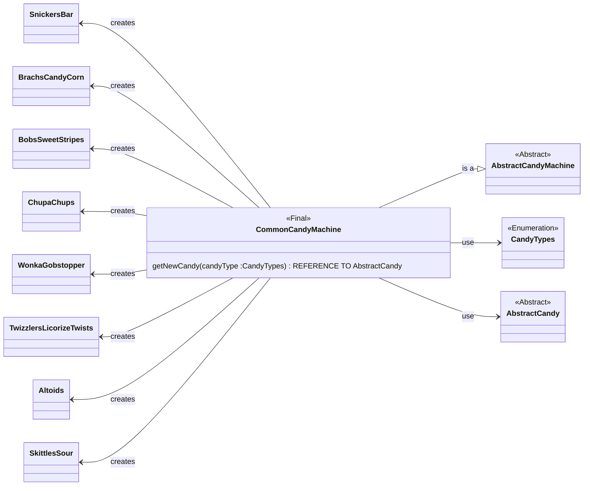
```mermaid
classDiagram
    direction LR
    CommonCandyMachine --|> AbstractCandyMachine :is a
    CommonCandyMachine --> CandyTypes :use
    CommonCandyMachine --> AbstractCandy :use
    SnickersBar <-- CommonCandyMachine :creates
    BrachsCandyCorn <-- CommonCandyMachine :creates
    BobsSweetStripes <-- CommonCandyMachine :creates
    ChupaChups <-- CommonCandyMachine :creates
    WonkaGobstopper <-- CommonCandyMachine :creates
    TwizzlersLicorizeTwists <-- CommonCandyMachine :creates
    Altoids <-- CommonCandyMachine :creates
    SkittlesSour <-- CommonCandyMachine :creates
    
    class CommonCandyMachine{
        <<Final>>
        getNewCandy(candyType :CandyTypes) REFERENCE TO AbstractCandy
    }
    class AbstractCandyMachine{
        <<Abstract>>
    }
    class CandyTypes{
        <<Enumeration>>
    }
    class AbstractCandy{
        <<Abstract>>
    }
    class SnickersBar
    class BrachsCandyCorn
    class BobsSweetStripes
    class ChupaChups
    class WonkaGobstopper
    class TwizzlersLicorizeTwists
    class Altoids
    class SkittlesSour
```

#### greedy candy machine

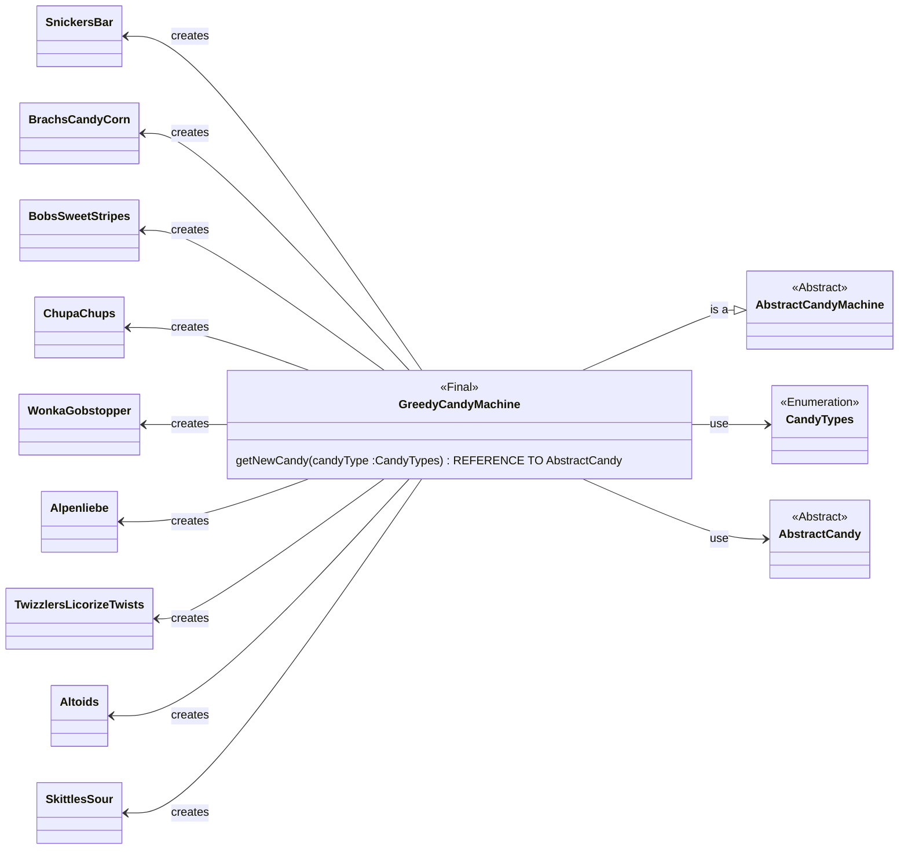
```mermaid
classDiagram
    direction LR
    GreedyCandyMachine --|> AbstractCandyMachine :is a
    GreedyCandyMachine --> CandyTypes :use
    GreedyCandyMachine --> AbstractCandy :use
    SnickersBar <-- GreedyCandyMachine :creates
    BrachsCandyCorn <-- GreedyCandyMachine :creates
    BobsSweetStripes <-- GreedyCandyMachine :creates
    ChupaChups <-- GreedyCandyMachine :creates
    WonkaGobstopper <-- GreedyCandyMachine :creates
    Alpenliebe <-- GreedyCandyMachine :creates
    TwizzlersLicorizeTwists <-- GreedyCandyMachine :creates
    Altoids <-- GreedyCandyMachine :creates
    SkittlesSour <-- GreedyCandyMachine :creates
    
    class GreedyCandyMachine{
        <<Final>>
        getNewCandy(candyType :CandyTypes) REFERENCE TO AbstractCandy
    }
    class AbstractCandyMachine{
        <<Abstract>>
    }
    class CandyTypes{
        <<Enumeration>>
    }
    class AbstractCandy{
        <<Abstract>>
    }
    class SnickersBar
    class BrachsCandyCorn
    class BobsSweetStripes
    class Alpenliebe
    class ChupaChups
    class WonkaGobstopper
    class TwizzlersLicorizeTwists
    class Altoids
    class SkittlesSour
```

#### picky candy machine

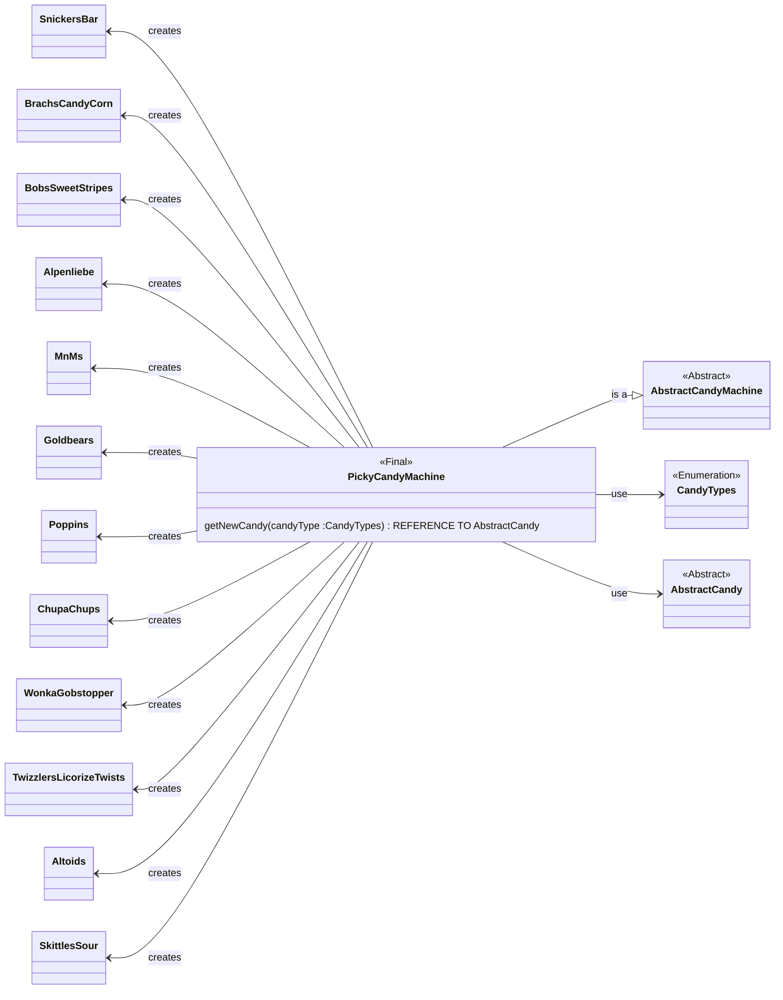
```mermaid
classDiagram
    direction LR
    PickyCandyMachine --|> AbstractCandyMachine :is a
    PickyCandyMachine --> CandyTypes :use
    PickyCandyMachine --> AbstractCandy :use
    SnickersBar <-- PickyCandyMachine :creates
    BrachsCandyCorn <-- PickyCandyMachine :creates
    BobsSweetStripes <-- PickyCandyMachine :creates
    Alpenliebe <-- PickyCandyMachine :creates
    MnMs <-- PickyCandyMachine :creates
    Goldbears <-- PickyCandyMachine :creates
    Poppins <-- PickyCandyMachine :creates
    ChupaChups <-- PickyCandyMachine :creates
    WonkaGobstopper <-- PickyCandyMachine :creates
    TwizzlersLicorizeTwists <-- PickyCandyMachine :creates
    Altoids <-- PickyCandyMachine :creates
    SkittlesSour <-- PickyCandyMachine :creates
    
    class PickyCandyMachine{
        <<Final>>
        getNewCandy(candyType :CandyTypes) REFERENCE TO AbstractCandy
    }
    class AbstractCandyMachine{
        <<Abstract>>
    }
    class CandyTypes{
        <<Enumeration>>
    }
    class AbstractCandy{
        <<Abstract>>
    }
    class SnickersBar
    class BrachsCandyCorn
    class BobsSweetStripes
    class Alpenliebe
    class MnMs
    class Goldbears
    class Poppins
    class ChupaChups
    class WonkaGobstopper
    class TwizzlersLicorizeTwists
    class Altoids
    class SkittlesSour
```

### candy machine provider

```mermaid
classDiagram
    CandyMachineProvider <|-- NinjaIncCandyMachineProvider :is a
    NinjaIncCandyMachineProvider --> ConsumerTypes :use
    NinjaIncCandyMachineProvider *-- GreedyCandyMachine :has a
    NinjaIncCandyMachineProvider *-- PickyCandyMachine :has a
    CommonCandyMachine --* CandyMachineProvider :has a
    AbstractCandyMachine <-- CandyMachineProvider :use

    class CandyMachineProvider{
        <<Abstract>>
        + getACandyMachine() REFERENCE TO AbstractCandyMachine
    }
    class AbstractCandyMachine{
        <<Abstract>>
    }
    class CommonCandyMachine
    class GreedyCandyMachine
    class PickyCandyMachine
    class ConsumerTypes{
        <<Enumeration>>
    }
    class NinjaIncCandyMachineProvider{
        + FB_Init(bInitRetains :BOOL, bInCopyCode :BOOL, consumerType :ConsumerTypes)
    }
```

### ninja candy consume behavior

#### AbstractNinjaCandyConsumeBehavior

```mermaid
classDiagram
    CandyMachineProvider <-- AbstractNinjaCandyConsumeBehavior :use
    SatisfactionLevelInPercent <-- AbstractNinjaCandyConsumeBehavior :use
    IndividualCandyPreferences <-- AbstractNinjaCandyConsumeBehavior :use
    AbstractCandyConsumer <-- AbstractNinjaCandyConsumeBehavior :use
    AbstractNinjaCandyConsumeBehavior --> TasteScale :use
    AbstractNinjaCandyConsumeBehavior *-- NinjaIncCandyMachineProvider :has a
    AbstractNinjaCandyConsumeBehavior --> CandyAmountInGram :use
    AbstractNinjaCandyConsumeBehavior --> ConsumerTypes :use
    class AbstractNinjaCandyConsumeBehavior{
        <<Abstract>>
        + calculateSatisfactionLevel(tastiness :TasteScale, amountOfCandy :CandyAmountInGram, [ref] actualSatisfactionLevel :SatisfactionLevelInPercent)*
        + FB_init(bInitRetains :BOOL, bInCopyCode :BOOL, candyMachineProvider :REFERENCE TO CandyMachineProvider) BOOL
        + lootACandyMachine(consumer :REFERENCE TO AbstractCandyConsumer, preferences :REFERENCE TO IndividualCandyPreferences REF= 0)
    }
    class NinjaIncCandyMachineProvider
    class CandyMachineProvider{
        <<Abstract>>
    }
    class IndividualCandyPreferences{
        <<Abstract>>
    }
    class TasteScale{
        <<Enumeration>>
    }
    class CandyAmountInGram{
        <<Alias>>
    }
    class SatisfactionLevelInPercent{
        <<Alias>>
    }
    class AbstractCandyConsumer{
        <<Abstract>>
    }
    class ConsumerTypes{
        <<Enumeration>>
    }
```

#### CommonNinjaCandyBehavior

```mermaid
classDiagram
    AbstractNinjaCandyConsumeBehavior <|-- CommonNinjaCandyBehavior :is a
    CommonNinjaCandyBehavior --> TasteScale :use
    CommonNinjaCandyBehavior --> SatisfactionLevelInPercent :use
    CommonNinjaCandyBehavior --> CandyAmountInGram :use

    class CommonNinjaCandyBehavior{
        + calculateSatisfactionLevel(tastiness :TasteScale, amountOfCandy :CandyAmountInGram, [ref] actualSatisfactionLevel :SatisfactionLevelInPercent)
    }
    class AbstractNinjaCandyConsumeBehavior{
        <<Abtsract>>
    }
    class TasteScale{
        <<Enumeration>>
    }
    class CandyAmountInGram{
        <<Alias>>
    }
    class SatisfactionLevelInPercent{
        <<Alias>>
    }   
```

#### GreedyNinjaCandyBehavior

```mermaid
classDiagram
    AbstractNinjaCandyConsumeBehavior <|-- GreedyNinjaCandyBehavior :is a
    NinjaIncCandyMachineProvider --* GreedyNinjaCandyBehavior :has a
    candyMachineProvider <-- GreedyNinjaCandyBehavior :use
    GreedyNinjaCandyBehavior --> TasteScale :use
    GreedyNinjaCandyBehavior --> SatisfactionLevelInPercent :use
    GreedyNinjaCandyBehavior --> CandyAmountInGram :use
    GreedyNinjaCandyBehavior --> ConsumerTypes :use

    class GreedyNinjaCandyBehavior{
        + calculateSatisfactionLevel(tastiness :TasteScale, amountOfCandy :CandyAmountInGram, [ref] actualSatisfactionLevel :SatisfactionLevelInPercent)
        + FB_init(bInitRetains :BOOL, bInCopyCode :BOOL, candyMachineProvider :REFERENCE TO CandyMachineProvider) BOOL
    }
    class AbstractNinjaCandyConsumeBehavior{
        <<Abtsract>>
    }
    class TasteScale{
        <<Enumeration>>
    }
    class ConsumerTypes{
        <<Enumeration>>
    }
    class CandyAmountInGram{
        <<Alias>>
    }
    class SatisfactionLevelInPercent{
        <<Alias>>
    }
    class NinjaIncCandyMachineProvider
    class candyMachineProvider{
        <<Abstract>>
    }
```

#### PickyNinjaCandyBehavior

```mermaid
classDiagram
    AbstractNinjaCandyConsumeBehavior <|-- PickyNinjaCandyBehavior :is a
    NinjaIncCandyMachineProvider --* PickyNinjaCandyBehavior :has a
    candyMachineProvider <-- PickyNinjaCandyBehavior :use
    PickyNinjaCandyBehavior --> TasteScale :use
    PickyNinjaCandyBehavior --> SatisfactionLevelInPercent :use
    PickyNinjaCandyBehavior --> CandyAmountInGram :use
    PickyNinjaCandyBehavior --> ConsumerTypes :use

    class PickyNinjaCandyBehavior{
        + calculateSatisfactionLevel(tastiness :TasteScale, amountOfCandy :CandyAmountInGram, [ref] actualSatisfactionLevel :SatisfactionLevelInPercent)
        + FB_init(bInitRetains :BOOL, bInCopyCode :BOOL, candyMachineProvider :REFERENCE TO CandyMachineProvider) BOOL
    }
    class AbstractNinjaCandyConsumeBehavior{
        <<Abtsract>>
    }
    class TasteScale{
        <<Enumeration>>
    }
    class ConsumerTypes{
        <<Enumeration>>
    }
    class CandyAmountInGram{
        <<Alias>>
    }
    class SatisfactionLevelInPercent{
        <<Alias>>
    }
    class NinjaIncCandyMachineProvider
    class candyMachineProvider{
        <<Abstract>>
    }
```

## Folder-Structure

*   **.\\**
*   **src\\** _root folder for all project sources_
*   **.gitignore**  _the git ignore file for this project_
*   **.gitattributes** _the git attribute file for the LFS support_
*   **README.md** _the file you read right now_

## Version-Log

### Versions 

1.	[0.0.0.0](#0000)
2.	[1.0.0.0](#1000)

#### 0.0.0.0 
_initial commit_

#### 1.0.0.0

This major release marks the completion of the foundational features of the **Candy Vending Machine Project**. The following is a detailed summary of the changes and features implemented in this version:

---

##### 🛠️ **Core Abstractions and Classes**
1. **Candy Machine Framework**:
   - Introduced `AbstractCandyMachine` to establish a flexible foundation for different consumer behaviors.
   - Implemented concrete candy machines:
     - `CommonCandyMachine` as the default.
     - `PickyCandyMachine` tailored for selective consumers like Ajnin.
     - `GreedyCandyMachine` designed for voracious consumers like Yeknom.
   - Added `AbstractCandyMachineProvider` to manage shared and custom candy machines with efficient memory usage via `VAR_STAT`.

2. **Candy Consumer**:
   - Developed `AbstractCandyConsumer` to define candy consumption behaviors.
   - Created the first concrete consumer, `NinjaMonkey`:
     - Automatically sets its name using instance paths with `{attribute 'reflection'}`.
     - Supports default and custom behaviors/preferences.
     - Implements `lootCandies` and `eat` methods.

3. **Candy Preferences**:
   - Introduced `IndividualCandyPreferences` for custom preferences.
   - Implemented `AjninsCandyPreferences` for picky monkeys; no preferences needed for greedy consumers like Yeknom.

4. **Candies**:
   - Built `AbstractCandy` as the foundation for all candies.
   - Added methods for logging, dispatcher management, and consumption handling.
   - Introduced concrete candies (`Goldbears`, `MnMs`, `Poppins`) for diverse use cases.

---

##### 📝 **Logging System**
1. **AbstractLogger**:
   - Defined an abstraction for flexible logging with methods for different log levels (`critical`, `error`, `warning`, `info`, `debug`).
   - Includes a `run` method for cyclic processing of buffered log messages.

2. **AdsLogger**:
   - Implemented a concrete logger with an internal ring buffer queue for message storage.
   - Supports dynamic resizing and ensures messages are printed with a 30ms delay for orderly outputs.
   - Integrated cleanup through the `FB_exit` method.

3. **LoggerProvider**:
   - Centralized logging management with `AdsLogger` as the default.
   - Ensures a single logger instance across the entire project.

4. **Integration**:
   - Integrated the new logger into `AbstractCandy.logCandyConsume` for well-ordered log messages.
   - Set up the `LoggerProvider` in the main task for consistent pre-use configuration.

---

##### 🌟 **Key Features and Enhancements**
- **Behavior**:
  - Added `AbstractNinjaCandyConsumeBehavior` to define how monkeys loot candy machines and calculate satisfaction levels.
  - Implemented:
    - `CommonNinjaCandyBehavior` with satisfaction calculated using a logarithm (base 6.359).
    - `GreedyNinjaCandyBehavior` and `PickyNinjaCandyBehavior` with tailored satisfaction calculations and distinct default providers.

- **Utility Enhancements**:
  - Created `AdsLogMessage` as a DTO for buffered ADS log messages with dynamic creation support.

- **Testing and Integration**:
  - Added monkey instances in the main task to verify functionality.
  - Log messages are now well-ordered, providing consistent and clear feedback.

---

### 🎉 **Version Highlights**
Version 1.0.0.0 provides a robust and scalable software for the **Candy Vending Machine Project**, supporting diverse consumer behaviors, flexible logging, and customizable candy handling. This release lays a solid foundation for future enhancements and showcases the power of abstraction and modular design.

🍬 **Ninja Monkeys are ready to loot candy machines in style!** 🐒✨
